# **CSE 15L Lab Report 1**

## **Installing VScode**

To install Visual Studio code, first go to the [VS Code](https://code.visualstudio.com) website. Download the version for the operating system you have, such as Windows or macOS. After finishing the installation, running VScode should open up with a window that looks like this:

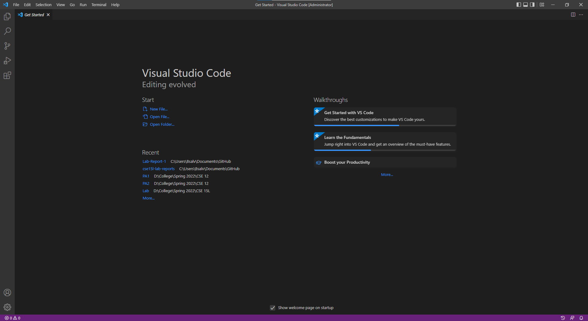 or this:

 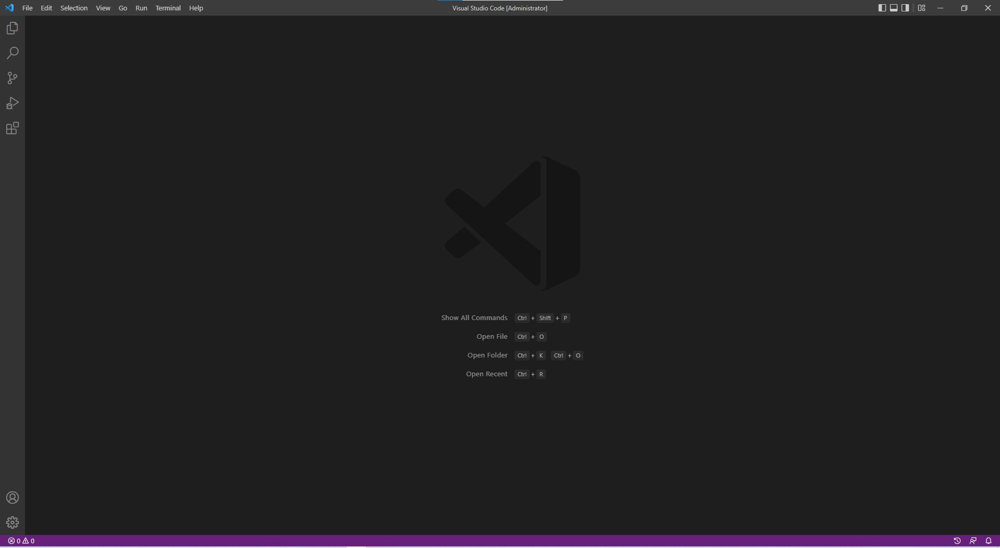
If you see this, you are good.

## **Remotely Connecting**

If you are on Windows, the first step to remotely connecting is to download OpenSSh, where you can follow the steps from this [link](https://docs.microsoft.com/en-us/windows-server/administration/openssh/openssh_install_firstuse) or follow the steps from here 

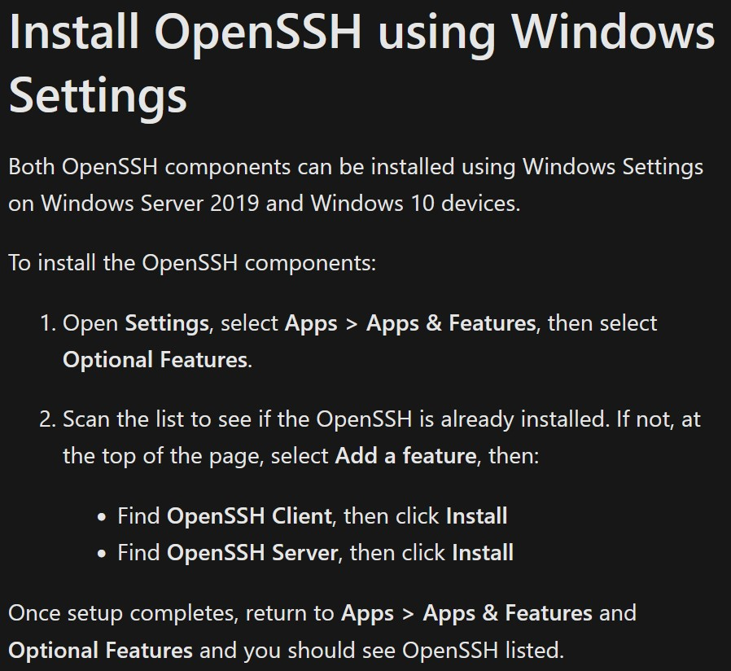 

and ensure you can find OpenSSH Client/Server in your apps, which should look like this: 

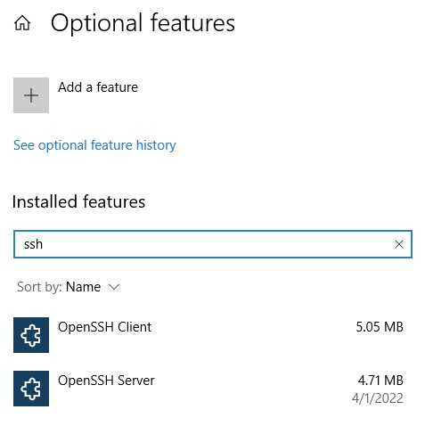

--- 

The next step is to find your course-specific account for CSE15L using this [link](https://sdacs.ucsd.edu/~icc/index.php). After logging in, you should see a page that looks like this and you can find your account name by looking under additional accounts. 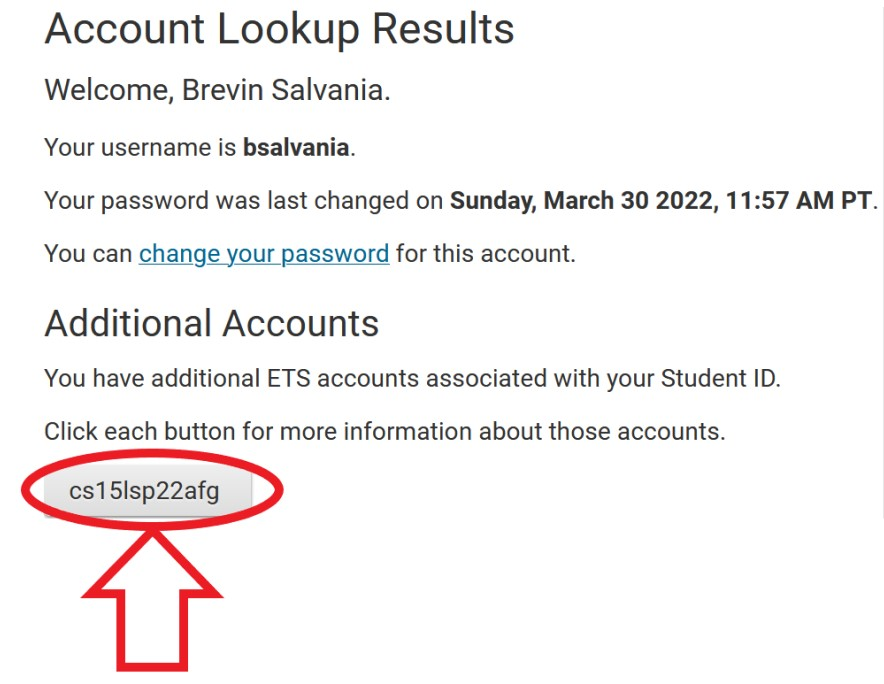

---
Finally, enter VSCode and open a terminal by clicking "Terminal" and then "New Terminal" in the top left of the window or by pressing "ctrl" + " ' " (button below escape key and to the left of 1 key) together at the same time. Then in the terminal, type in ssh cs15lsp22zz@ieng6.ucsd.edu, replacing the zz with the letters in your course-specific account (like how mine is afg as seen above). 

If this is the first time you have connected to the server, you will get a message like `The authenticity of host 'ieng6.ucsd.edu (128.54.70.227)' can't be established.` and `RSA key fingerprint is SHA256:ksruYwhnYH+sySHnHAtLUHngrPEyZTDl/1x99wUQcec.` and
`Are you sure you want to continue connecting (yes/no/[fingerprint])?` This is to be expected if its your first time connecting, so type yes in the terminal. If it isn't and you get this message again, someone may be trying to listen in on or control the connection. If so, follow this [link](https://superuser.com/questions/421074/ssh-the-authenticity-of-host-host-cant-be-established/421084#421084) by Ben Voigt to find out more about what is happening.

After saying yes, it will prompt you for your password, so copy and paste it in as that will ensure you put it in correctly. Don't worry about the fact that you can't see it, its invisible so that others won't steal your password. Once you have logged in, you should see something like this: 

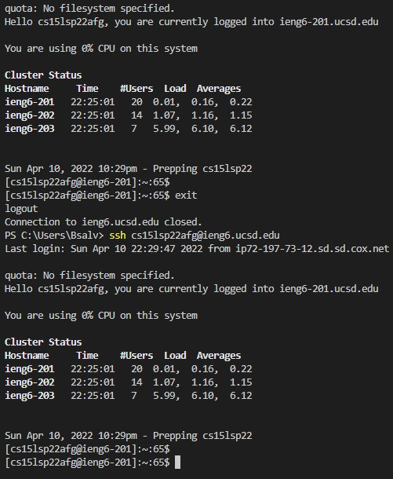

If you see "You are using 0% CPU on this system," you have successfully logged in and you are now remotely connected to a computer in the CSE basement. Any commands you run on your terminal will run on that computer.

## **Trying Some Commands**
There are many command you can run, which may have different results depending on if you use them on *your* computer versus the remote computer after ssh-ing. Try running these commands (to try out a command, just copy and paste one in your terminal):
* cd ~
* cd
* ls -lat
* ls -a
* ls <directory> where <directory> is /home/linux/ieng6/cs15lsp22/cs15lsp22abc, where the abc is one of the other group members’ username
* cp /home/linux/ieng6/cs15lsp22/public/hello.txt ~/
* cat /home/linux/ieng6/cs15lsp22/public/hello.txt

Try and see if you can find out what each command does. For example, when I ran `cp /home/linux/ieng6/cs15lsp22/public/hello.txt ~/`, I saw this message, 

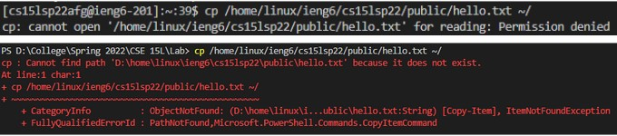 

with the remote computer message on top and my computer's message below.
I saw different messages dependent on whether I used the command on my computer vs the remote computer, so make sure to try out the commands on both.
 

## **Moving Files with scp**

One power of remote connection is being able to copy files from your computer to the remote computer and vice versa. We will use a command called `scp`, which will always be run from your computer, not the one logged into ieng6. To try this out, create a file in VSCode called WhereAmI.java, and copy this in: 

    class whereAmI {
        public static void main(String[] args) {
            System.out.println(System.getProperty("os.name"));
            System.out.println(System.getProperty("user.name"));
            System.out.println(System.getProperty("user.home"));
            System.out.println(System.getProperty("user.dir"));
        }
    }

Compile it and run it using `javac` and `java` on the terminal in your computer (if you don't have java, skip this). You should see something like this: 

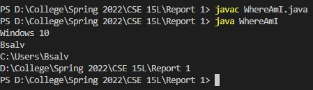

Then run this command `scp WhereAmI.java cs15lsp22zz@ieng6.ucsd.edu:~/` in the terminal from the directory where you made this file (make sure to replace the zz). Like with ssh, it will prompt you for a password, so just put it in. Then log in with ssh again and use `ls`. You should see the file there, so run it on the *ieng6 computer* using `javac` and `java` (java is installed on the server so everyone can do this step). The result should look something like this: 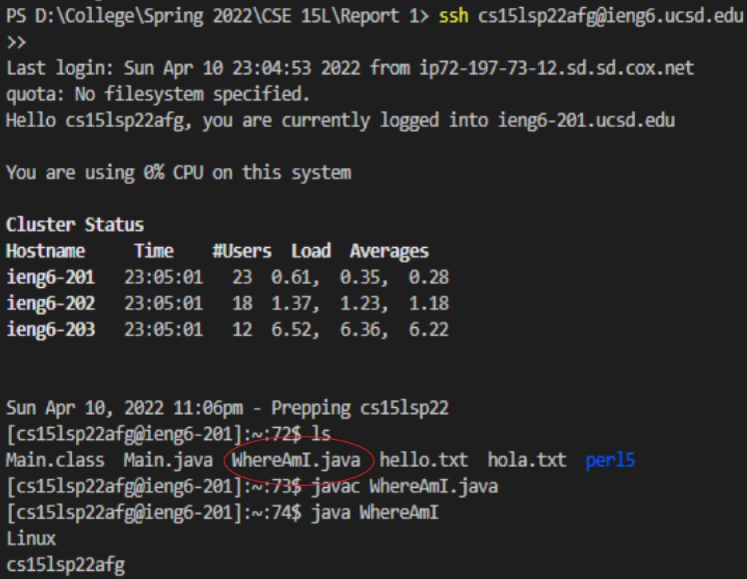

## **Setting an SSH Key**
Using ssh or scp requires us to input our password each time, so a way to bypass that is `SSH Keys`. A program, called `ssh-keygen` creates a *public key* and *private key*, where you keep the private key on your computer (client) and send a copy of the public key to the remote computer (server). To set this up, follow these commands (if you're on windows, there will be a few different parts, which will be bolded. Instead of `id_rsa`, you will see  `id_ed25519` or something like that):

* on client (your computer)
* ssh-keygen (windows users use `ssh-keygen -t ed25519`)
* Generating public/private **rsa** key pair.
* Enter file in which to save the key (/Users/<user-name>/.ssh/id_rsa): /Users/<user-name>/.ssh/**id_rsa**
* Enter passphrase (empty for no passphrase): (**Note: Do not add a passphrase**)
* Enter same passphrase again: 
* Your identification has been saved in /Users/<user-name>/.ssh/**id_rsa**.
* Your public key has been saved in /Users/<user-name>/.ssh/**id_rsa**.pub.
* The key fingerprint is:
* SHA256:jZaZH6fI8E2I1D35hnvGeBePQ4ELOf2Ge+G0XknoXp0 <user-name>@<system>.local
* The key's randomart image is:
* +---[RSA 3072]----+
* |                 |
* |       . . + .   |
* |      . . B o .  |
* |     . . B * +.. |
* |      o S = *.B. |
* |       = = O.*.*+|
* |        + * *.BE+|
* |           +.+.o |
* |             ..  |
* +----[SHA256]-----+

Then we need to copy the *public* key to the .ssh directory of your user account on the server, so follow these next steps (windows users replace `id_rsa` with `id_ed25519`):
* ssh cs15lsp22zz@ieng6.ucsd.edu (replace zz)
* Enter Password
* now on server
* mkdir .ssh
* logout
* *back on client
* scp /Users/user-name/.ssh/**id_rsa**.pub cs15lsp22zz@ieng6.ucsd.edu:~/.ssh/authorized_keys (You use your username and the path you saw in the command above. Window's users replace `id_rsa` with `id_ed25519`).

It should look something like this: 

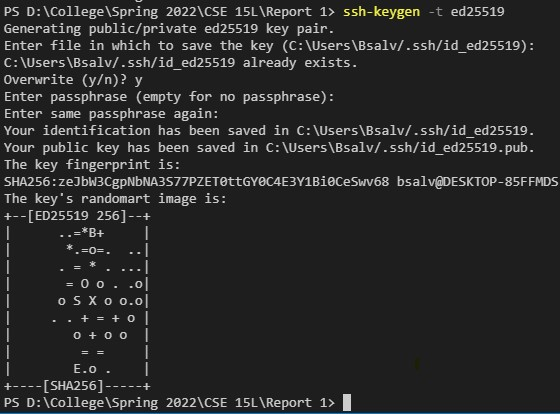

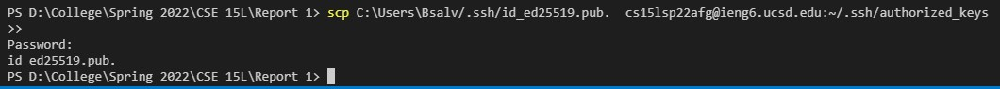 

## **Optimizing Remote Running**
Now, you can log in to the remote computer without inputting a password. It should go something like this: 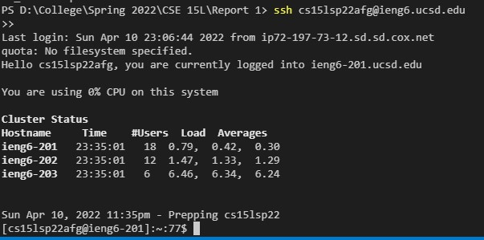

There is no longer a prompt for a password. Some other ways to optimize remote running is using the up-arrow on your keyboard to recall the last command that was run. You can use semicolons to run multiple commands on the same line in most terminals. For example, `cp WhereAmI.java OtherMain.java; javac OtherMain.java; java WhereAmI`. And can write a command in quotes at the end of an ssh command to directly run it on the remote server, then exit. For example, this command will log in and list the home directory on the remote server: `ssh cs15lsp22zz@ieng6.ucsd.edu "ls"`
 
 ---
 [Homepage](https://bsalvania.github.io/cse-15l-lab-reports/)
