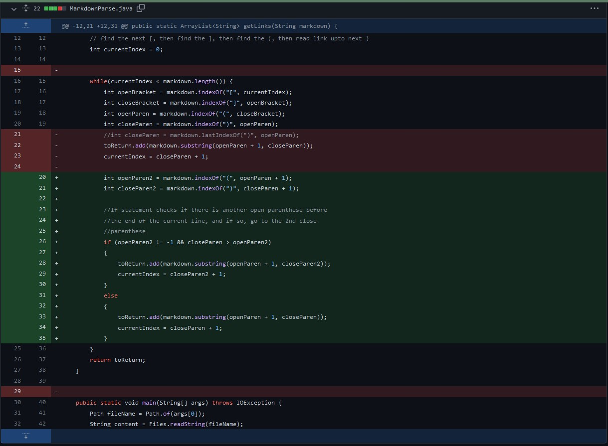
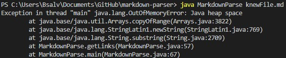

# **CSE 15L Lab Report 2**

## Change 1: Infinite loop fix (Link with parenthesis inside)

* Code Change: 
* Link to test file for *failure-inducing input*: [link](https://github.com/bsalvania/markdown-parser/commit/98d2429e664e5a49cc3501ce27a87d8a6dc61c91)
    * 4th link causes infinite loop
* Symptom: 
* The bug was that because there were multiple parenthesis in the 4th link (the failure-inducing input), the variable closeParen got the wrong index. This made it so that the while loop never finished, with the bug causing an infinite loop, as currentIndex would never become greater than markdown.length(). 

## Change 2: Differentiating between an image and a link
