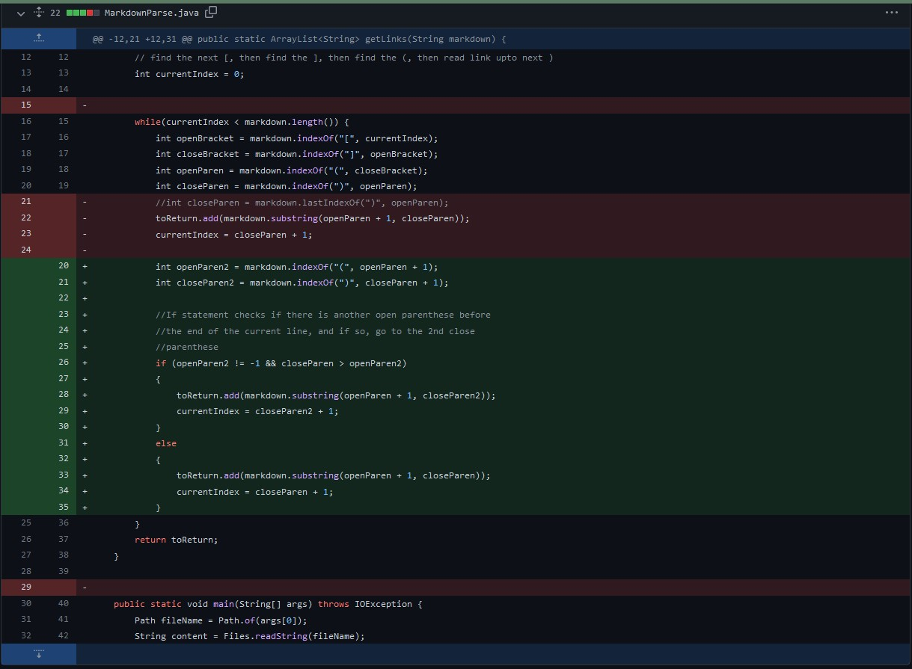
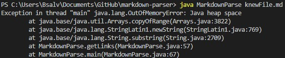
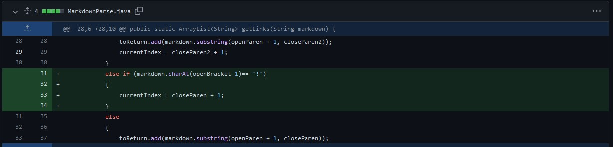
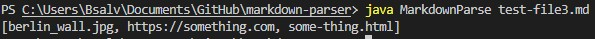
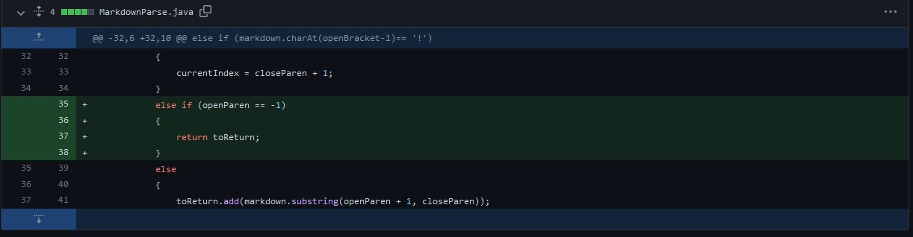
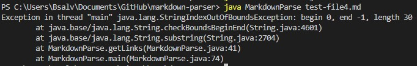

# **CSE 15L Lab Report 2**

## Change 1: Infinite loop fix (Link with parenthesis inside)

* Code Change: 

* Link to test file for *failure-inducing input*: [link](https://github.com/bsalvania/markdown-parser/commit/98d2429e664e5a49cc3501ce27a87d8a6dc61c91)
    * The 4th link causes an infinite loop. This is because the method never reaches the end of the file as it gets the wrong index for the variables closeParen.

* Symptom: 

* The failure-inducing input causes the bug to show its symptoms as the bug doesn't show any symptoms unless the input has a link with multiple parentheses. The bug was that because there were multiple parentheses in the 4th link (the failure-inducing input), the variable closeParen got the wrong index. This made it so that the while loop never finished, with the bug causing an infinite loop, as currentIndex would never become greater than markdown.length(). 
---
## Change 2: Differentiating between an image and a link

* Code Change: 

* Link to test file for *failure-inducing input*: [link](https://github.com/TheJoeship/markdown-parser-fork/commit/ca97f28fa6755f1d48b519a208765e39ffd9a4f2 ) 
    * Links to a group member's repository

    * The problem is that the method thinks an image is a link and thus adds it to the array list of links. This is a problem because the array list should only contain links that the file has.
* Symptom: 

* The failure-inducing input causes the bug to show its symptoms as the bug doesn't show any symptoms unless the input has an image. The bug is that the method would grab images and insert them into the array list. As a result, the output would include links and images, instead of just links.
---
## Change 3: Index Out Of Bounds fix (No link and brackets in .md file)

* Code Change: 

* Link to test file for *failure-inducing input*: [link](https://github.com/bsalvania/markdown-parser/commit/f405559bd7eeb5e0f402101995ec66bd2fbce98f)

    * Because there are no links, the index given to the method for some of its variables are -1 (in this case openParen and closeParen). This causes the *toReturn.add(markdown.substring(openParen + 1, closeParen));* code to throw an index out of bounds exception because it tries to access a string from 0 to -1, which isn't possible.

* Symptom: 

* The failure-inducing input causes the bug to show its symptoms as the bug doesn't show any symptoms unless the input has no links. The bug is that the method will try to get a substring from index 0 to index -1, because when there are no links and thus no parentheses, some variables will have an index equal to -1. As a result, the bug shows its symptoms by throwing an index out of bounds exception.

---
[Homepage](https://bsalvania.github.io/cse-15l-lab-reports/index.html)