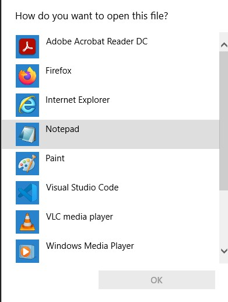

# **CSE 15L Lab Report 3**

## **Streamlining ssh Configuration**
To streamline my ssh Configuration, first I navigated to the config file in my .ssh folder as seen in the image below. 


I then double clicked the config file (you can click the file, then right click, and then click open with) and when it asked how I wanted to open the file, I clicked "Notepad". 

 

Finally, in the config file, I wrote in 
```
Host ieng6 
  HostName ieng6.ucsd.edu
  User cs15lsp22afg (<-- My account, change the last few letters to your own account)
```
as seen in the image below. 


This allows me to ssh easier as I can just type in ```ssh ieng6```
to log into my remote account. I don't have to remember everything else and type in this longer command ```ssh cs15lsp22afg@ieng6.ucsd.edu```. You can see the first one is much easier to type in and remember. 


 ---
 [Homepage](https://bsalvania.github.io/cse-15l-lab-reports/index.html)