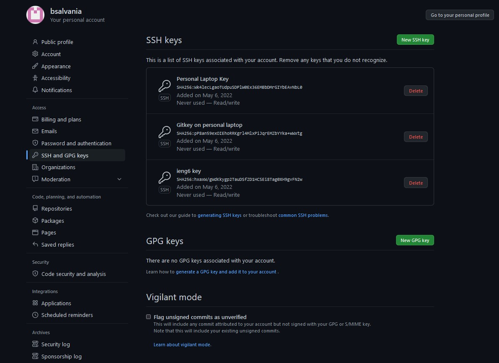

# **CSE 15L Lab Report 3**

## **Streamlining ssh Configuration**
To streamline my ssh Configuration, first I navigated to the config file in my .ssh folder as seen in the image below. 


I then double clicked the config file (you can click the file, then right click, and then click open with) and when it asked how I wanted to open the file, I clicked "Notepad". 

 

Finally, in the config file, I wrote in 
```
Host ieng6 (ieng6 is an alias, you can change it to whatever you want)
  HostName ieng6.ucsd.edu
  User cs15lsp22afg (<-- My account, change the last few letters to your own account)
```
as seen in the image below. 


This allows me to ssh easier as I can just type in ```ssh ieng6```
to log into my remote account. I don't have to remember everything else and type in this longer command ```ssh cs15lsp22afg@ieng6.ucsd.edu```. You can see the first one is much easier to type in and remember. You can see me using the first command below.


I can even copy files to my account using scp command and just my alias. For example, my current directory in my account looks like this:


After making any file, lets say Test.java, I can use the command ```scp Test.java ieng6:~/``` and it will appear in the home directory of my account. After using the command, you can see the file in my home directory of my account in the image below.


---
## Setup Github Access from ieng6
To see where the public key I made is stored on Github, I first clicked the top right icon with my profile picture and clicked settings. 


Then I navigated to where the *access* section of the sidebar, clicked ```SSH and GPG keys```, and I can see my public key.


My public and private key that is stored in my usre account can be seen here: 


Now that my ieng6 account and Github are connected, I can commit and push changes using my ieng6 account. For example, if I make changes to my Test.java file, I can use the terminal for my ieng6 account and run the commands `git add Test.java`, and then `git commit -m "Commit and push change to Test.java on ieng6 account"`, and finally `git push origin main` . You can see in the image down below. 


Link to the resulting commit: [Link](https://github.com/bsalvania/markdown-parser/commit/3a8bf91500f6d70c4394cb8526141ebd937d5c6d)

---
## Copy whole directories with ```scp -r```
Since it would be arduous to copy and send each and every file in our directory to our remote account, an easier way is to copy and send the whole directory. To copy a directory, you run the command `scp -r . cs15lsp22afg@ieng6.ucsd.edu:~/markdown-parse-copy`. `-r` tells scp to run recursively, meaning it'll copy everything withing the directory, the `.` means the directory you are currently in and want to copy, and `~/markdown-parse-copy` tells scp to create a directory with that name and put all the files in that directory. Here is the result of running the command: 
Here is the result of compiling and running the tests for my new repository:


Here is the result of combining all these steps to copy the whole directory and run the tests in one line:


 ---
 [Homepage](https://bsalvania.github.io/cse-15l-lab-reports/index.html)