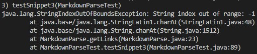
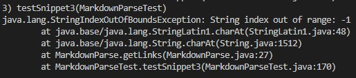

# **CSE 15L Lab Report 4**

## My markdown-parse repository: [Link](https://github.com/bsalvania/markdown-parser)
## Reviewed markdown-parse repository: [Link](https://github.com/jina-leemon/markdown-parser)

## Snippet 1
* Expected output: [url.com, google.com, google.com, ucsd.edu]
* Image of the code for the test: 
* Output of **my implementation**: 
* Output of **reviewed implementation**: 

* I think there is a small code change that will make my program work for snippet 1 and all related cases that use inline code with backticks. Since the backtick only affects the output if they are within the parentheses, I would use an if statement to check if there is a backtick right after the open parentheses or if there is a backtick right before the closing parentheses. If so, then I would increment the variable for the index of the open parentheses or decrement the variable for the index of the closed parentheses by 1, to ignore the backticks.

## Snippet 22
* Expected output: [a.com, b.com, a.com(()), example.com]
* Image of the code for the test: 

* Output of **my implementation**: 
* Output of **reviewed implementation**: 

* I think there isn't a small code change that will make the program work for snippet 2 and all related cases that nest parentheses, brackets, and escaped brackets. This is because checking for extra parentheses or brackets is extremely hard, especially when they are nested within each other and when there is a numerous amount of them. Making code to examine each individual bracket and parenthesis and having the program identify whether or not it corresponds to a link is difficult as cases like snippet 2 do not follow a format, and thus it would be hard to account for all the different cases that comes from extra brackets and parentheses.

## Snippet 3
* Expected output: [https://www.twitter.com, https://sites.google.com/eng.ucsd.edu/cse-15l-spring-2022/schedule, github.com, https://cse.ucsd.edu/]
* Image of the code for the test: 
* Output of **my implementation**: 
* Output of **reviewed implementation**: 

* I think there isn't a small code change that will make the program work for snippet 3 and all related cases that have newlines in brackets and parentheses. Like with snippet 2, there are all sorts of cases that can happen when dealing with newlines in brackets and parentheses. For example, there can be 1 new line or 10 new lines. Additionally, adding a link that is missing brackets and/or parentheses will be difficult for the same reason. With many different scenarios, it would be hard to code for where the string starts and where it ends.

 ---
 [Homepage](https://bsalvania.github.io/cse-15l-lab-reports/index.html)