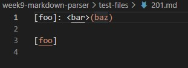
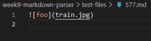
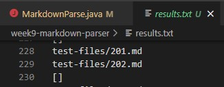
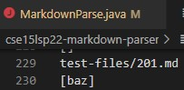
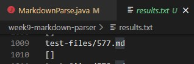
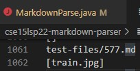
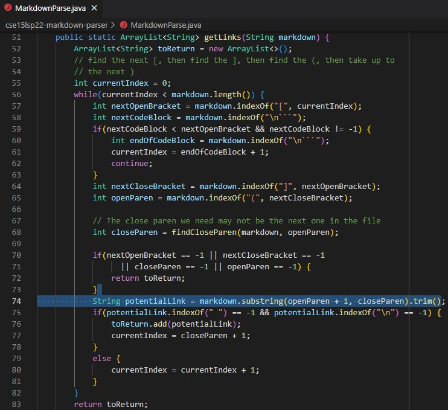

# **CSE 15L Lab Report 5**

* How I found the tests with different results: I found the tests with different results using vimdiff on the results of running a bash for loop. I first ran `bash script.sh > results.txt ` on the implementation provided for lab 9, then ran `bash script.sh > results.txt` on my own implementation to get the results of each test for both implementations. Then I ran `vimdiff week9-markdown-parser/results.txt cse15lsp22-markdown-parser/results.txt` to compare the results, with the information before the `/` being the directory where the .txt file was located.
* Link to test-file with different results: 
1. https://github.com/nidhidhamnani/markdown-parser/blob/main/test-files/201.md

2. https://github.com/bsalvania/markdown-parser/blob/main/577.md

---
## Test One
* 
* My output: 

* Output for provided implementation: 

---
## Test Two
* My implementation is correct because file 577.md only contains an image and no links. My implementation returned a blank array list, as it should because there are no links. The given implementation is wrong because it put the image into the array list, thinking it was a link.
* Expected output: []
* My output: 

* Output for provided implementation: 

* Bug in the provided implementation: The bug in the provided implementation is that it thinks the image is a link. The code does not check for exclamation points in the file. So, a fix to the bug can be adding an if statement where if there is an exclamation point before the variable `nextOpenBracket`, then we ignore that part of the string and set `currentIndex` to `closeParen + 1`. The if statement can be added after the highlighted section because if it gets to that point, then the method thinks its a link.
* Highlighted code: 
 ---
 [Homepage](https://bsalvania.github.io/cse-15l-lab-reports/index.html) 